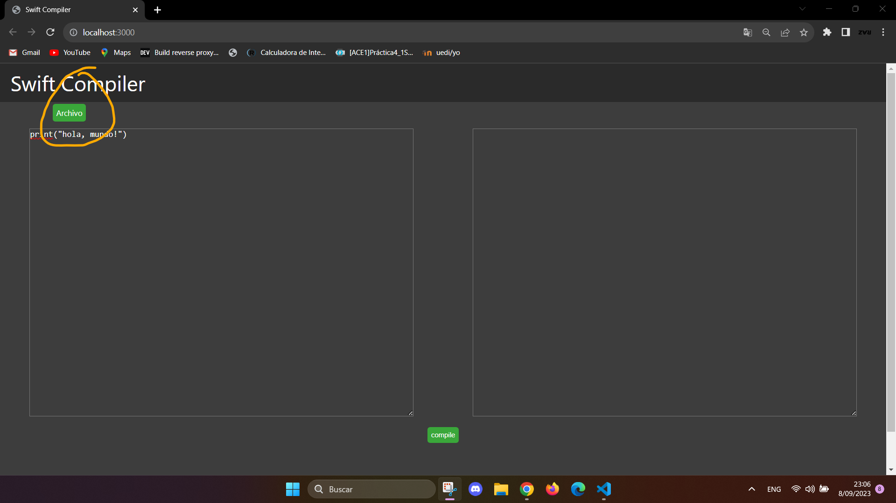
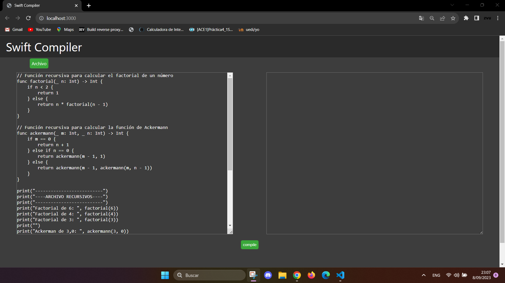
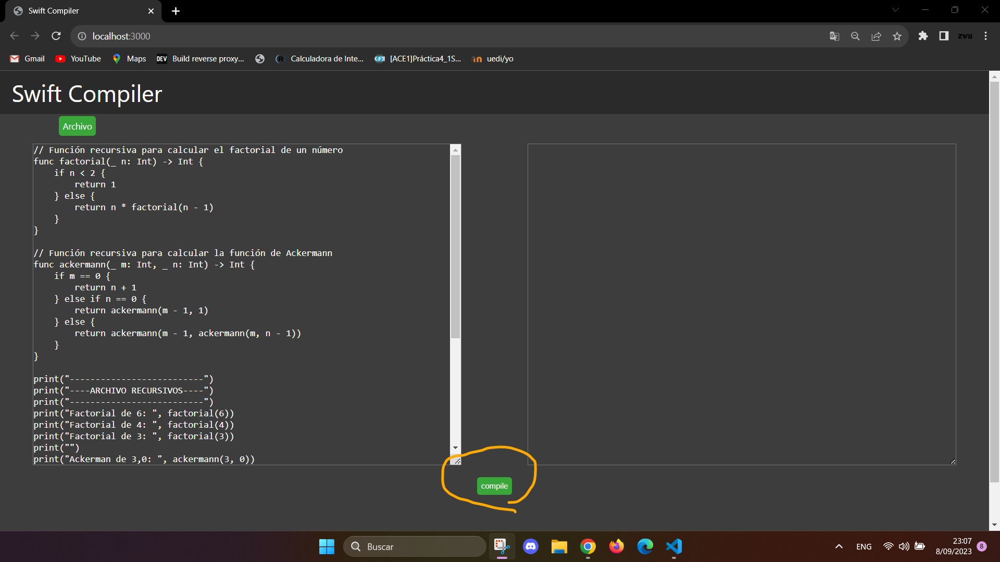
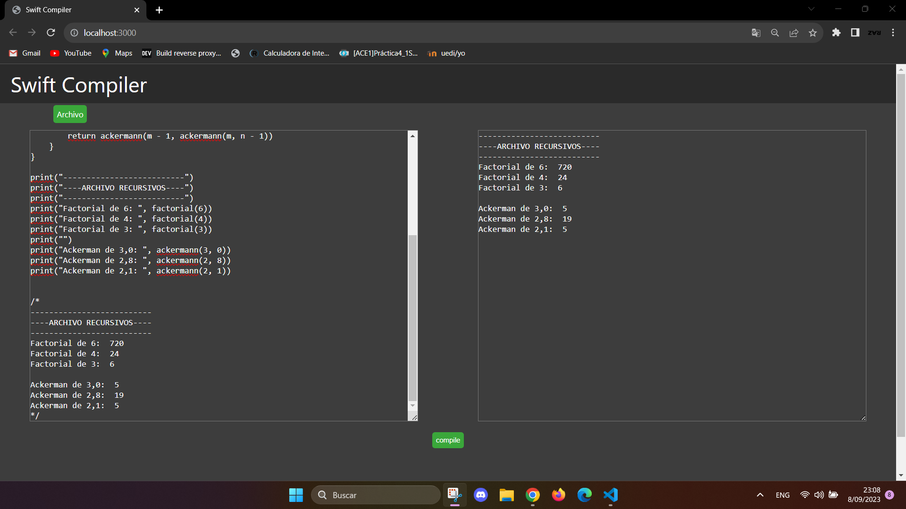

# MANUAL DE USUARIO

Para poder usar el compilador de swift primero se tiene que escribir en la sintaxis del lenguaje swift del lado derecho

O bien se puede importar un archivo dandole al boton de arriba a la izquierda.

luego de haber escrito o importado un archivo se le tiene que dar al boton `compile`.

luego de haberle dado al boton de compilar saldra el resultado del lado derecho de lo que imprime la consola.
